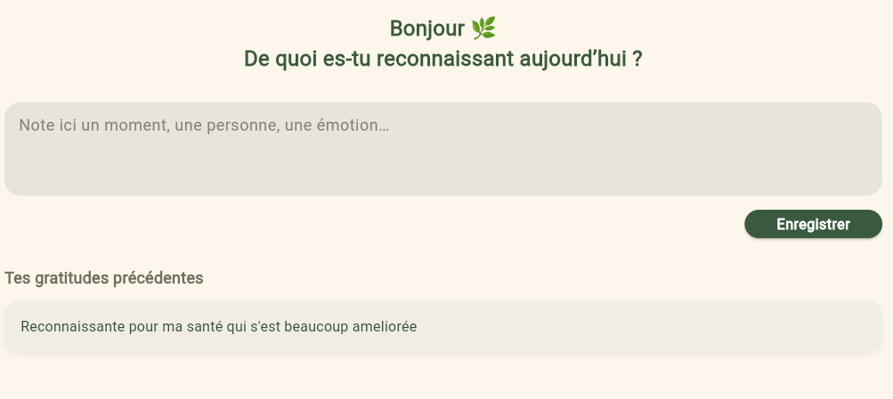

# thanks_journal

## Description
Application mobile permettant d’écrire et de consulter des notes de gratitude quotidiennes.  
Chaque entrée est automatiquement associée à une date et stockée localement sur l’appareil.  
Ce projet est le **douzième** du défi personnel **100 projets en 2026**.

---

## Objectifs du projet
- Créer une application orientée bien-être
- Gérer des données associées à des dates
- Implémenter un CRUD simple en local
- Concevoir une UX calme et introspective

---

## Plateforme
- Mobile 

---

## Technologies utilisées
- Flutter
- Dart
- `shared_preferences` (stockage local)

---

## Fonctionnalités
- Ajouter une note de gratitude
- Association automatique à la date du jour
- Consultation des entrées précédentes
- Suppression d’une entrée
- Sauvegarde locale automatique

---

## Design & UX
- Interface apaisante et minimaliste
- Mise en page aérée favorisant l’écriture
- Typographie lisible et chaleureuse
- Navigation simple et fluide

---

## Captures d’écran

---

## Ce que j’ai appris
- Gestion des dates en Flutter
- Persistance de données locales
- Structuration d’un CRUD simple
- Conception d’une UX émotionnelle

---

## Améliorations possibles
- Rappels quotidiens
- Recherche par date
- Mode sombre
- Export des entrées

---

## Statut du projet
 **Projet terminé**
